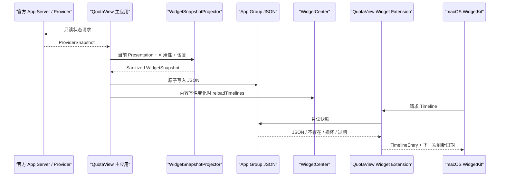

# QuotaView 原生 WidgetKit 接入设计

> 文档编号：`QV-DESIGN-WIDGET-001`<br>
> 文档类型：SDD 已发布架构/功能规格<br>
> 规格状态：`Accepted`<br>
> 交付状态：`Released`（0.2.1 首次发布；0.3.1 Build 2 共享容器热修复）<br>
> 文档版本：`2.1`<br>
> 依赖：`QV-EXEC-CORE-002` Phase 0–2<br>
> 原始设计基线：QuotaView `0.1.5 (Build 6)`<br>
> 当前生产基线：QuotaView `0.3.5 (Build 5)`；本版未改变 WidgetKit 数据与界面契约<br>
> 当前开发校准：`0.3.5 Build 6` 按 `QV-ARCH-PERSONAL-SIGNING-006`
> 迁移至 Personal Team `7KP9UX9AA3`；品牌标识按
> `QV-BRAND-TIDE-WINDOW-005` 已迁移为 Widget 专用 12 pt 潮汐窗矢量并进入
> 视觉验收；公开
> Build 5 历史身份不变<br>
> 编写日期：2026-07-28<br>
> SDD 状态更新：2026-08-04<br>
> 适用平台：macOS 14 及以上<br>
> 参考实现：CodexBar，固定分析版本
> `dd029db4cb17811edd5805d952c5d5fc23395be3`

## WIDGET-00. 如何使用本文档

本文档是 QuotaView 接入 macOS 原生桌面小组件的专项设计。实现或讨论时可直接
引用章节编号，例如：

- “按 `WIDGET-05` 实现快照协议”；
- “按 `WIDGET-07` 实现时间线”；
- “按 `WIDGET-11` 修改 Xcode 工程”；
- “按 `WIDGET-13` 做发布验证”。

本文档最初用于 Widget 实施前设计；Widget 已在 `0.2.1` 进入生产，并在
`0.3.1 (Build 2)` 完成 Developer ID 直接分发所需的团队前缀 App Group
热修复。本文现作为现行架构、数据语义和回归验收规格维护，不得再把
“尚未实施”解释为当前状态。任何后续修改仍需先按项目根目录 `AGENTS.md`
与 [SDD 规格索引](../specs/README.md) 核对当前代码和产品约束。

### WIDGET-00.1 当前生产映射

| 项目 | `0.3.3 (Build 3)` 当前事实 |
|---|---|
| Team | `BUUH229D5Q` |
| 主应用 Bundle ID | `com.quotaview.menubar` |
| Widget Bundle ID | `com.quotaview.menubar.widget` |
| App Group | `BUUH229D5Q.com.quotaview.shared` |
| Extension Target / Product | `QuotaViewWidgetExtension` / `QuotaViewWidgetExtension.appex` |
| 共享 Contract | `Sources/QuotaViewWidgetContract/WidgetSnapshot.swift` |
| 主应用投影与写入 | `Sources/QuotaView/QuotaViewWidgetSnapshotWriter.swift` |
| Extension 实现 | `Sources/QuotaViewWidget/QuotaViewWidget.swift` |
| 配置与权限 | `Configs/App.xcconfig`、`Configs/Widget.xcconfig`、`Support/*.entitlements` |
| 当前版本 | 主应用与 Extension 均为 `0.3.3 (3)` |
| 发布验证 | Universal、Developer ID、Apple 公证、Staple、真实安装与共享容器通过；视觉仍等待产品所有者验收 |

当前映射优先于本文保留的首版候选代码和实施步骤。后文凡使用
“建议”“新增”“后续”等原始实施措辞，均应结合本表和相应章节的完成状态
理解，不能解释为 Widget 尚未进入生产。

### WIDGET-00.2 Build 6 本地签名映射

Build 6 的本地开发身份使用主 App `com.stoven.quotaview`、Widget
`com.stoven.quotaview.widget` 与 App Group
`7KP9UX9AA3.com.stoven.quotaview.shared`。该映射只用于当前 Build 6
个人签名验证，不改写 Build 5 的已发布 Team、Bundle、App Group 或更新
信任链；具体范围与验收见
[`QV-ARCH-PERSONAL-SIGNING-006`](./quotaview-personal-signing-migration-0.3.5-build6.md)。

核心架构、Provider、刷新、历史、通知与操作模式见
[`quotaview-core-architecture-evolution.md`](./quotaview-core-architecture-evolution.md)。

---

## WIDGET-01. 结论

QuotaView 当前采用与 CodexBar 同类的原生 WidgetKit 架构：

> 主应用读取官方状态、生成脱敏快照并原子写入 App Group；Widget Extension
> 只读取该快照、生成时间线并显示。

这是适合 QuotaView 的成熟方案，原因是：

- Widget 不读取凭据；
- Widget 不启动 Codex App Server 或其他 Provider；
- 主应用与 Widget 的职责清晰；
- Extension 可以被系统独立唤醒；
- 运行和安装成本较小；
- 快照协议可以稳定测试和演进。

但首版不照搬 CodexBar 的 Widget 数量和复杂度。QuotaView 首版只提供一个
“Usage” Widget，支持 Small 和 Medium 两种尺寸，不提供：

- Large Widget；
- 多种历史、费用、Burn Rate Widget；
- Provider 选择 AppIntent；
- Widget 内写操作；
- 额度自动重置按钮；
- Widget 直接读取历史数据库；
- Widget 直接刷新 Provider。

---

## WIDGET-02. 目标与非目标

### WIDGET-02.1 目标

1. 使用 Apple WidgetKit 创建真正的 macOS Widget Extension；
2. 在桌面和通知中心显示 QuotaView 的最新脱敏额度摘要；
3. 与主应用的“可用/不可用”语义一致；
4. 支持 QuotaView 简体中文、English 和跟随系统语言设置；
5. 支持 Small 和 Medium；
6. 快照过期、损坏、版本未知时有稳定占位状态；
7. 不影响菜单栏 UI、刷新性能和当前功能；
8. 保持 Universal `arm64 + x86_64` 打包；
9. 保持 Extension 体积小，只包含已确认的 Asta Sans 字体和 Widget 专用
   资源，不复制主应用完整 Asset Catalog。

### WIDGET-02.2 非目标

- Widget 不是实时监控面板；
- 不保证分钟级精确刷新；
- 不从 Widget 发起 App Server RPC；
- 不使用 Widget 绕过主应用的数据边界；
- 不把历史库复制进 App Group；
- 不在 Widget 中显示账户标识或敏感原始数据；
- 不提供额度重置、自动使用额度或其他账户写操作；
- 不复刻主面板 Liquid Glass；
- 不要求主应用持续常驻才能渲染已有快照。

---

## WIDGET-03. 系统架构与数据流



### WIDGET-03.1 职责

| 组件 | 负责 | 不负责 |
|---|---|---|
| 主应用 | 读取 Provider、判断最新数据状态、生成快照 | Widget 布局 |
| `WidgetSnapshotProjector` | 脱敏、裁剪、格式语义和版本化 | 文件 I/O、RPC |
| `WidgetSnapshotStore` | App Group URL、编码、原子写入、读取 | 业务推断 |
| Widget Extension | 快照解码、过期判断、时间线、展示 | Provider、历史采集、写操作 |
| WidgetKit | 调度、缓存、渲染生命周期 | 保证精确刷新 |

### WIDGET-03.2 单向数据流

数据只允许：

```text
Provider → 主应用 → 脱敏快照 → App Group → Widget
```

禁止：

```text
Widget → Provider
Widget → 账户写操作
Widget → 主应用内存状态
Widget → 凭据或原始响应
```

Widget 可以通过 `widgetURL` 打开主应用，但不能在 URL 中携带账户、额度、
Token 或操作授权。

---

## WIDGET-04. Target 与代码边界

### WIDGET-04.1 当前 Target

```text
QuotaView.app
├── QuotaView
├── QuotaViewCore
└── QuotaViewWidgetContract

QuotaViewWidgetExtension.appex
├── QuotaViewWidget
└── QuotaViewWidgetContract
```

`QuotaViewWidgetContract` 是 Extension-safe 边界：

- 依赖 Foundation；
- 不依赖 AppKit；
- 不依赖 `QuotaViewCore` 的 Provider 实现；
- 不使用 `Process`、Security、Keychain 或网络；
- 不引用写操作协议。

SwiftUI、WidgetKit、Asta Sans 注册和 Widget 专用资源只存在于 Extension
Target，不进入 Contract。主应用侧的 Projector/Writer 也不编译进 Extension。

### WIDGET-04.2 当前目录

```text
Sources/QuotaViewWidgetContract/
└── WidgetSnapshot.swift

Sources/QuotaView/
└── QuotaViewWidgetSnapshotWriter.swift

Sources/QuotaViewWidget/
├── QuotaViewWidget.swift
├── Localizable.xcstrings
└── WidgetAssets.xcassets/

Configs/Widget.xcconfig
Support/QuotaViewWidget-Info.plist
Support/QuotaViewWidget.entitlements
```

`Package.swift` 已提供小型 `QuotaViewWidgetContract` library product；
`QuotaView.xcodeproj` 提供真正的 Extension Target、宿主嵌入、entitlements
和签名配置。Swift Package 不能替代 `.appex` 的这些职责。

### WIDGET-04.3 禁止依赖

通过构建设置和代码审查保证：

- `APPLICATION_EXTENSION_API_ONLY = YES`；
- Extension 不链接 `QuotaViewCore` 的进程/RPC实现；
- Extension 源码中没有 `Process(`；
- Extension 源码中没有 `SecItem`、Keychain 或 Cookie；
- Extension 源码中没有额度 consume 方法；
- Extension 不打开 SQLite 历史库；
- Extension 不发起网络请求。

---

## WIDGET-05. 快照协议

### WIDGET-05.1 顶层结构

当前 schema 1 顶层结构：

```swift
public struct QuotaViewWidgetSnapshot: Codable, Equatable, Sendable {
    public static let currentSchemaVersion = 1

    public let schemaVersion: Int
    public let generatedAt: Date
    public let expiresAt: Date
    public let updatedAt: Date?
    public let localeIdentifier: String
    public let availability: WidgetDataAvailability
    public let provider: ProviderWidgetPayload?
}
```

可用性只有两个值：

```swift
public enum WidgetDataAvailability: String, Codable, Sendable {
    case available
    case unavailable
}
```

Widget 外观始终跟随 WidgetKit/System，快照不保存主应用的浅色/深色偏好。
`localeIdentifier` 由主应用写入当前解析后的语言标识。

### WIDGET-05.2 Provider payload

```swift
public struct ProviderWidgetPayload: Codable, Equatable, Sendable {
    public let providerID: String
    public let displayName: String
    public let plan: String?
    public let primaryWindow: WidgetQuotaWindow?
    public let auxiliaryMetrics: [WidgetAuxiliaryMetric]
    public let availableResetCredits: Int?
}

public struct WidgetQuotaWindow: Codable, Equatable, Sendable {
    public let usedFraction: Double?
    public let remainingFraction: Double?
    public let resetsAt: Date?
}

public struct WidgetAuxiliaryMetric: Codable, Equatable, Identifiable, Sendable {
    public let id: String
    public let label: String
    public let formattedValue: String
}
```

当前最多保留三个辅助指标，标识为 Credits、今日 Tokens 和累计 Tokens；
Widget 只投影实际显示的数据，不把完整 `ProviderSnapshot` 编码进共享容器。

### WIDGET-05.3 可用性语义

主应用生成快照时：

- 最新 Provider 状态有效：`availability = .available`，写入 provider；
- 最新请求失败：`availability = .unavailable`，`provider = nil`；
- 从未获得有效快照：`availability = .unavailable`，`provider = nil`；
- 应用设置关闭 Provider：`availability = .unavailable`，`provider = nil`；
- 必需字段缺失：保持可选字段为空，不伪造 `0`；
- 过期判断由 Extension 根据 `expiresAt` 再执行一次。

即使主应用内存中有上一次成功数据，最新请求失败后也不能继续把旧额度作为
“当前有效值”写给 Widget。这与 QuotaView 当前主面板语义一致。

### WIDGET-05.4 时间语义

- `generatedAt`：主应用生成本文件的时间；
- `updatedAt`：成功获取 Provider 数据的时间；
- `expiresAt`：超过后 Widget 必须显示不可用；
- `resetsAt`：额度窗口官方重置时间，可空。

当前 `expiresAt` 使用共享常量 `snapshotLifetime = 15 分钟`；Timeline 最短
重读间隔使用 `minimumTimelineReloadInterval = 5 分钟`。两者均定义在
`QuotaViewWidgetConfiguration`，不在多个 Target 中重复硬编码。

### WIDGET-05.5 Schema 版本

首版：

```swift
static let currentSchemaVersion = 1
```

当前解码策略：

- 版本 `1`：正常读取；
- 未来较新版本：返回 unsupported，不猜测字段；
- 损坏文件：返回 corrupt；
- 任何错误均转换为稳定不可用 entry，不让 Extension 崩溃。

兼容原则：

- 新增可选字段可维持当前版本；
- 删除、改名、改变单位或语义必须升级版本；
- 只有发布了新 schema 后，才为仍需兼容的上一生产 schema 增加显式适配器；
- 快照写入与 Extension 发布必须在同一 App 版本中协调。

### WIDGET-05.6 大小与隐私

首版 JSON 目标小于 `16 KB`，硬上限为 `64 KB`。投影器必须过滤：

- 账户邮箱、用户名、组织真实 ID；
- 访问 Token、Cookie、Keychain 引用；
- 原始 RPC JSON；
- 会话、Prompt、代码和路径；
- 操作授权、操作请求和完整审计；
- 不显示的历史点。

---

## WIDGET-06. App Group 与原子存储

### WIDGET-06.1 App Group ID

主应用和 Extension 必须使用同一个、在 Apple Developer 配置中登记的
Application Group。当前构建变量为：

```text
QUOTAVIEW_APP_GROUP_ID
```

当前生产值已经固定为：

```text
BUUH229D5Q.com.quotaview.shared
```

Team ID 为 `BUUH229D5Q`。该值由 App/Widget xcconfig 提供，并在 Build 2 的
Developer ID 直接分发环境中通过真实共享容器验证。构建时把同一个值：

1. 写入两个 Target 的 `com.apple.security.application-groups` entitlement；
2. 写入两个 bundle 的 `QuotaViewAppGroupID` Info.plist key；
3. 由共享层读取并校验；
4. 在 Release 验证中比较是否完全相同。

这样保留了 CodexBar“按签名 Team 隔离”的成熟思路，但 QuotaView 使用单一
构建配置源，避免主应用与 Extension 各自推导出不同 ID。

### WIDGET-06.2 Bundle ID

当前生产 Bundle ID：

```text
主应用：com.quotaview.menubar
Widget：com.quotaview.menubar.widget
```

任何后续修改必须同步签名和发布配置，不能只修改源码字符串。

### WIDGET-06.3 Entitlements

主应用至少新增：

```xml
<key>com.apple.security.application-groups</key>
<array>
    <string>$(QUOTAVIEW_APP_GROUP_ID)</string>
</array>
```

Widget Extension 至少使用：

```xml
<key>com.apple.security.app-sandbox</key>
<true/>
<key>com.apple.security.application-groups</key>
<array>
    <string>$(QUOTAVIEW_APP_GROUP_ID)</string>
</array>
```

Extension 不添加网络客户端、用户文件或 Keychain entitlement。

主应用当前保持 `ENABLE_APP_SANDBOX = NO`，Extension 使用
`ENABLE_APP_SANDBOX = YES`。为了 App Group 不得顺便改变这一既有发布权限
模型。

### WIDGET-06.4 存储文件

```text
App Group Container/
└── QuotaViewWidgetSnapshot.json
```

写入：

```swift
let data = try encoder.encode(snapshot)
try data.write(to: url, options: [.atomic])
```

编码使用 `millisecondsSince1970` 日期和排序键。原子写入可防止 Extension
在主应用写到一半时读取到截断 JSON。

### WIDGET-06.5 失败与回退

- 主应用拿不到 App Group URL：记录脱敏诊断，不调用 reload；
- Extension 拿不到 App Group URL：显示“打开 QuotaView 获取数据”；
- 无文件：显示首次使用状态；
- 损坏或不支持版本：显示不可用状态；
- 不写入 Application Support fallback 给正式 Widget 使用，因为两个进程
  无法依靠普通容器安全共享；
- 单元测试通过注入临时目录测试 Store，不依赖真实 entitlement。

### WIDGET-06.6 签名限制

App Group 是签名能力。`0.3.1 (Build 2)` 已完成主应用、Widget 和 Helper
的 Developer ID 签名，Apple 公证与 Staple，以及安装后的真实 App Group
写入和 Widget 时间线读取验证。

后续无签名/ad-hoc Release 构建仍只能验证编译、架构、嵌入和基本 bundle
结构，不能替代已签名版本的跨进程共享回归验收。

真实 Widget 数据共享至少需要：

- 主应用和 Extension 使用同一 Team；
- App Group 已在开发者配置中登记；
- 两个 Target 的最终签名包含相同 App Group entitlement；
- 嵌套 `.appex` 使用与主应用兼容的签名；
- 在签名构建上做一次真实桌面 Widget 验收。

---

## WIDGET-07. 快照生成、变更签名与重载

### WIDGET-07.1 生成时机

主应用在以下状态完成后尝试生成 Widget 快照：

- Provider 刷新成功；
- Provider 刷新失败并使最新状态变为不可用；
- 当前状态重新发布时携带最新解析语言；
- 应用启动并恢复到一个可判定状态；
- Provider 被关闭；
- 窗口重置后新数据到达。

当前没有独立 Widget 显示设置。语言偏好变化是否需要立即触发一次额外写入，
仍属于 `WIDGET-12 Step 5` 的待验证项。

不要在每次 SwiftUI body 计算、倒计时每秒变化或无关设置变化时写文件。

### WIDGET-07.2 Projector

```swift
struct QuotaViewWidgetSnapshotProjector {
    func makeSnapshot(
        presentation: CurrentCodexPresentation?,
        isAvailable: Bool,
        localeIdentifier: String,
        now: Date
    ) -> QuotaViewWidgetSnapshot
}
```

Projector 是纯函数：

- 不访问磁盘；
- 不调用 Provider；
- 不调用 WidgetCenter；
- 不读取全局单例；
- 所有输入显式传入；
- 可以完整做单元测试。

### WIDGET-07.3 展示签名

为了避免频繁调用 `reloadAllTimelines()`，对会改变 Widget 视觉的字段计算
稳定签名：

```text
availability
localeIdentifier
provider payload（plan、额度窗口、辅助指标、重置次数）
```

不把 `generatedAt` 单独作为签名输入，否则每次刷新都会强制重载。

流程：

1. 生成快照；
2. 每次 `publish` 原子写入最新快照；
3. 与进程内上一次 reload signature 比较；
4. 签名变化或距离上次 reload 已满 5 分钟时调用 WidgetCenter；
5. 首版只有一个 kind，可调用
   `WidgetCenter.shared.reloadTimelines(ofKind:)`，无需 `reloadAllTimelines()`。

### WIDGET-07.4 写入失败

写入失败：

- 不影响主面板当前数据；
- 不触发 Widget reload；
- 记录一次节流后的脱敏日志；
- 后续正常状态变化可再次尝试；
- 不进入高频重试循环。

---

## WIDGET-08. Timeline Provider

### WIDGET-08.1 Entry

```swift
struct QuotaViewWidgetEntry: TimelineEntry {
    let date: Date
    let snapshot: QuotaViewWidgetSnapshot?
    let isPlaceholder: Bool
}
```

视图根据 `snapshot` 与 `isPlaceholder` 渲染有效、不可用或 Gallery 占位状态。

### WIDGET-08.2 Placeholder

`placeholder(in:)` 使用固定、无账户含义的占位：

- 不读取 App Group；
- 不显示真实或疑似真实数值；
- 使用脱敏示例形状；
- 保持与 Small/Medium 真实布局接近。

### WIDGET-08.3 Snapshot

`getSnapshot(in:completion:)`：

- Widget Gallery 预览时返回 placeholder；
- 普通上下文尝试读取共享快照；
- 过期、损坏或不可用时返回 unavailable；
- 不发起刷新或打开主应用。

### WIDGET-08.4 Timeline 算法

当前 Timeline 每次只生成一个 entry。下一次重读日期为快照到期时间，并
限制在“从现在起至少 5 分钟、至多 15 分钟”的范围内；无快照时按 15 分钟
重读。重置时间用于显示，不单独生成秒级 entry。

### WIDGET-08.5 调度边界

| 场景 | 建议 |
|---|---|
| 普通有效快照 | 在快照到期点检查 |
| 最小主动间隔 | 不低于 5 分钟 |
| 最大普通间隔 | 不超过 15 分钟 |
| 临近重置 | 当前不增加独立 entry，由下一次 Timeline 重读更新 |
| 快照过期 | 在过期点进入不可用 |
| 无快照/不可用 | 15 分钟后检查 |

WidgetKit 可能合并、延迟或忽略建议时间，UI 文案不能声称“实时”或保证精确
倒计时。重置倒计时应使用系统相对时间文本，让系统在无需完整 timeline
重载时更新显示。

### WIDGET-08.6 不主动拉起主应用

Timeline Provider 不能：

- 用 URL scheme 静默唤醒应用；
- 启动 helper；
- 用 DistributedNotification 请求刷新；
- 高频触发 Background Activity；
- 以数据过期为由调用 Provider。

用户点击 Widget 可正常打开 QuotaView，由主应用按自身刷新策略更新数据。

---

## WIDGET-09. 首版 Widget 产品设计

### WIDGET-09.1 Widget 定义

```text
Kind: QuotaViewUsageWidget
Display name: QuotaView
Families: systemSmall, systemMedium
Configuration: StaticConfiguration
```

首版使用 `StaticConfiguration`。只有第二个 Provider 已正式接入且用户确实
需要为不同 Widget 选择 Provider 时，才评估 `AppIntentConfiguration`。

### WIDGET-09.2 Small

信息层级：

```text
┌────────────────────┐
│ QuotaView   可用    │
│                    │
│        67%         │
│      本周期剩余     │
│                    │
│ 2天后重置     Plus │
└────────────────────┘
```

显示：

- QuotaView 标识；
- `5 × 5 pt` 连接状态圆点及辅助功能标签；
- 主窗口剩余百分比；
- “本周期剩余”标签；
- 用量进度条；
- 相对重置时间；
- 可选计划名称。

限制：

- 不显示超过一个进度图；
- 不显示操作按钮；
- 不显示账户身份；
- 缺少数据时使用破折号，不显示 `0%`。

### WIDGET-09.3 Medium

信息层级：

```text
┌──────────────────────────────────────┐
│ QuotaView · Codex          可用       │
│                                      │
│ 本周期剩余  67% ━━━━━━━━━━━━━━━       │
│                                      │
│ 5小时窗口 82%   重置 2天后   次数 3   │
│                              刚刚更新 │
└──────────────────────────────────────┘
```

显示：

- 左栏 QuotaView 标识、主窗口百分比、计划、周期标签、进度和重置倒计时；
- 右栏连接状态圆点；
- 右栏四行固定指标：下次重置、Credits 余额、今日 Tokens、累计 Tokens。

辅助指标来自快照的 `auxiliaryMetrics`，Extension 不读取主应用设置；当前
尚未提供用户自定义 Widget 指标选择。

### WIDGET-09.4 不可用状态

```text
┌────────────────────┐
│ QuotaView   不可用  │
│                    │
│         —          │
│ 暂无最新额度数据    │
│                    │
│ 打开 QuotaView 刷新 │
└────────────────────┘
```

区分内部原因便于日志和测试，但用户文案保持简单：

- 首次无快照：打开 QuotaView 获取数据；
- 最新读取失败：暂无最新额度数据；
- 快照过期：数据已过期，请打开 QuotaView；
- Schema 不支持或文件损坏：无法读取小组件数据。

所有数值、订阅和次数均显示破折号或不显示，不能展示旧快照为当前值。

### WIDGET-09.5 视觉边界

Widget 使用系统原生容器与 QuotaView 已确认的紧凑数据排版：

- `.containerBackground(for: .widget)`；
- 打包的 Asta Sans 用于已确认的数据、标签与指标字号；
- `.primary`、`.secondary` 和语义状态色；
- 系统动态圆角与内边距；
- 深浅色跟随 WidgetKit；
- Increase Contrast 和 Reduced Motion 自动适配。

Build 6 的左上角品牌标识由 `QV-BRAND-TIDE-WINDOW-005` 唯一约束：Small 与
Medium 共用专为 `12 × 12 pt` 适配的无红点潮汐窗矢量，图标继续作为装饰从
辅助功能树隐藏，不改变标题、连接状态点或 Widget 数据布局。

不复制：

- 主面板 258 pt 固定尺寸；
- `NSGlassEffectView`；
- 自定义 Liquid Glass 填充与阴影；
- 主应用透明面板背景；
- 主应用 24 pt 功能按钮。

这不是改变 QuotaView 已确认的 UI。Widget 属于 Apple 管理的独立呈现环境，
应保持原生可读性，同时沿用 QuotaView 的状态语义和克制的数据层级。

---

## WIDGET-10. 本地化、辅助功能与隐私

### WIDGET-10.1 本地化

QuotaView 支持应用内语言设置，Widget 不能依赖主应用进程中的 `AppCopy`。
当前实现：

- 主应用把最终 `localeIdentifier` 写入快照；
- `WidgetCopy` 在 Extension 内提供有限的中英文文案；
- `followSystem` 由主应用解析为当时的 locale identifier；
- 系统语言变化后，主应用下次启动/激活时重写快照并 reload；
- 日期和相对时间使用固定 locale 的 Foundation formatter 或 SwiftUI
  系统格式；
- 快照中 Provider/指标标题可以保存已经本地化、脱敏的显示字符串。

Widget 文案必须覆盖：

- 可用/不可用；
- 本周期剩余；
- 重置时间；
- 更新时间；
- 无快照、过期、损坏；
- 打开 QuotaView；
- 计划和次数的可选标签。

### WIDGET-10.2 辅助功能

- 百分比不能只靠进度条颜色表达；
- 进度条有完整 accessibility label/value；
- Small 的阅读顺序为产品、状态、主值、周期、重置；
- Medium 的辅助指标按视觉顺序朗读；
- 不把装饰图标暴露成重复元素；
- Dynamic Type 导致空间不足时优先减少辅助信息，不裁切主值；
- 高对比度下使用系统语义色；
- Widget 不依赖 Hover/Pressed 才能理解状态。

### WIDGET-10.3 隐私

- 桌面可被旁人看到，默认不显示账户名称；
- 设置可选择隐藏精确额度，未来可投影为状态级别；
- `widgetURL` 只使用固定路由，例如 `quotaview://overview`；
- 系统日志不打印完整快照；
- 崩溃信息不附加快照 JSON；
- 删除应用或关闭 Widget 能力时可以删除共享快照；
- Widget 永远不显示官方操作授权或自动规则细节。

---

## WIDGET-11. Xcode 工程与构建修改

### WIDGET-11.1 Xcode Target

当前 `QuotaView.xcodeproj` 已包含：

- Product Type：App Extension；
- Target：`QuotaViewWidgetExtension`；
- Product：`QuotaViewWidgetExtension.appex`；
- Sources：`Sources/QuotaViewWidget`；
- Dependency：`QuotaViewWidgetContract`；
- Frameworks：SwiftUI、WidgetKit；
- Deployment Target：macOS 14；
- `APPLICATION_EXTENSION_API_ONLY = YES`；
- `ENABLE_APP_SANDBOX = YES`；
- 独立 Info.plist 和 entitlements；
- 与主应用一致的版本和 Build。

主应用已包含：

- 对 Widget Extension Target 的依赖；
- “Embed App Extensions” Copy Files Phase；
- 目标路径 `Contents/PlugIns/QuotaViewWidgetExtension.appex`；
- App Group entitlement。

### WIDGET-11.2 Info.plist

Extension 至少包含：

```xml
<key>CFBundlePackageType</key>
<string>XPC!</string>
<key>NSExtension</key>
<dict>
    <key>NSExtensionPointIdentifier</key>
    <string>com.apple.widgetkit-extension</string>
</dict>
<key>QuotaViewAppGroupID</key>
<string>$(QUOTAVIEW_APP_GROUP_ID)</string>
```

`CFBundleShortVersionString` 和 `CFBundleVersion` 必须与主应用同步。

### WIDGET-11.3 Package.swift

当前已提供：

```swift
.library(
    name: "QuotaViewWidgetContract",
    targets: ["QuotaViewWidgetContract"]
)
```

该 Target 的依赖保持为空或只依赖纯领域值 Target。不要因为 Widget 添加一个
完整的共享 UI 框架。

### WIDGET-11.4 build-app.sh

现有 `scripts/build-app.sh` 已执行并必须持续保持：

1. 构建 Extension 的 Universal Release；
2. 校验 `arm64 x86_64`；
3. 把 `.appex` 嵌入主应用 `Contents/PlugIns`；
4. 先签 `.appex` 内部 framework/可执行文件；
5. 再签 `.appex`；
6. 最后签主应用；
7. 检查主应用和 Extension entitlement；
8. 检查版本一致；
9. 在压缩前运行 `codesign --verify --deep --strict`（签名构建）；
10. 无签名构建明确标记 App Group 尚未做运行验收。

签名顺序必须从最内层到最外层。不能在签完主应用后再修改或替换 `.appex`。

### WIDGET-11.5 本地开发

无正式签名时：

- 可以编译 Extension；
- 可以运行共享快照的临时目录单元测试；
- 可以检查 Bundle、Info.plist、架构和嵌入；
- 不能把普通 Application Support fallback 当作真实 App Group 验收；
- 不修改产品逻辑绕过 entitlement。

---

## WIDGET-12. 实施顺序与当前完成状态

| Step | 当前状态 |
|---|---|
| Step 1 | 已完成：Contract、codec、文件存储、调度常量、过期与大小验证已发布 |
| Step 2 | 已完成：主应用 Projector/Writer 与签名节流已发布 |
| Step 3 | 已完成：Small/Medium StaticConfiguration Extension 已发布 |
| Step 4 | 已完成：Build 2 已通过签名、嵌入、公证与真实共享容器验证 |
| Step 5 | 部分完成：快照包含解析后的语言和不可用状态；专用指标选择、精确值隐私设置及语言偏好变化的即时重写验收尚未交付 |

下方保留原始退出标准作为回归门禁，不表示已完成 Step 需要重新实施。

### Step 1：纯共享协议（已完成）

- 创建 `QuotaViewWidgetContract`；
- 实现快照、codec、文件 Store 和 Schedule 常量；
- 使用临时目录测试；
- 不添加 Extension Target。

退出标准：

- 快照不含敏感字段；
- 缺失值不变成 0；
- 版本、过期和损坏测试通过。

### Step 2：主应用写入（已完成）

- 在标准化状态稳定后接入 Projector；
- 原子写入；
- 加 presentation signature；
- 不改变主面板 UI；
- App Group 不可用时主应用正常。

退出标准：

- 只有必要状态变化触发 reload；
- 写入失败不影响当前功能；
- 无高频 I/O。

### Step 3：Extension MVP（已完成）

- 添加 Widget Target；
- 实现 StaticConfiguration；
- 实现 Small/Medium；
- 实现 placeholder/unavailable；

退出标准：

- Extension 无 Provider/Process/凭据/操作依赖；
- Preview 和测试不需要真实账户；
- 所有状态布局稳定。

### Step 4：签名、嵌入和发布（已完成）

- 配置真实 App Group；
- 配置两个 Target entitlement；
- 扩展构建与签名脚本；
- 验证 Universal `.appex`；
- 在签名 Release 上做真实系统测试。

退出标准：

- 主应用和 Extension 使用完全相同的 App Group；
- 系统能发现 Widget；
- 主应用刷新后 Widget 最终更新；
- 视觉与交互标记为等待用户验收。

### Step 5：设置整合（部分完成）

- 已完成：快照投影解析后的语言，Provider 不可用时写 unavailable；
- 未完成：专用 Widget 指标选择；
- 未完成：精确值隐私设置；
- 待验证并按需补齐：语言偏好变化后不等待下一次普通状态更新即可重写快照。

退出标准：

- 设置变化不会启动额外 Provider；
- Extension 不直接读取主应用 UserDefaults；
- 所有选择通过快照投影。

---

## WIDGET-13. 测试与验收

### WIDGET-13.1 单元测试

#### 快照

- 默认 App Group 使用 Developer Team 前缀；
- OpenAI 方案名称归一与未知值隐藏；
- schema v1 有界编解码（毫秒时间戳）；
- 过期与未知 schema 拒绝；
- 超过 `64 KB` 的 payload 拒绝。

#### Projector

- 只发布脱敏 Widget 字段；
- 不可用时不保留 Provider 数据；
- 可选指标缺失时使用稳定占位，不伪造 `0`；
- 原子写入，并按签名或 5 分钟间隔限制 Timeline reload。

当前自动化未把 `TimelineProvider` 调度拆成独立纯函数测试；5–15 分钟边界
由代码审查和 Extension 构建覆盖。若后续改变调度算法，应先补独立测试。

### WIDGET-13.2 静态安全检查

检查 Extension 源码与链接产物中不存在：

- `Process`；
- `CodexAppServerClient`；
- `SecItem` / Keychain；
- Cookie；
- `account/rateLimitResetCredit/consume`；
- SQLite 历史访问；
- 网络请求。

Asta Sans 与 Widget 专用图标是当前已确认资源，不属于禁止项；检查目标是
不复制完整主应用 Asset Catalog 或无关资源。

### WIDGET-13.3 构建检查

```text
QuotaView.app/
└── Contents/
    └── PlugIns/
        └── QuotaViewWidgetExtension.appex/
```

验证：

- 主应用 `arm64 x86_64`；
- Extension 可执行文件 `arm64 x86_64`；
- 两者版本/Build 一致；
- Extension bundle ID 正确；
- `NSExtensionPointIdentifier` 正确；
- `APPLICATION_EXTENSION_API_ONLY` 生效；
- 主应用和 Extension App Group entitlement 一致；
- 嵌套签名顺序正确；
- `.app` 修改后重新验证签名；
- 压缩包中 `.appex` 未丢失。

### WIDGET-13.4 产品验收矩阵

| 维度 | 场景 |
|---|---|
| Family | Small / Medium |
| 外观 | 浅色 / 深色 / 高对比度 |
| 语言 | 简体中文 / English / 跟随系统 |
| 数据 | 有效 / 无快照 / 最新失败 / 过期 / 损坏 |
| 字段 | 有计划 / 无计划 / 有重置时间 / 无重置时间 / 零次数 |
| 生命周期 | 首次添加 / 主应用刷新 / 主应用退出 / 系统重启 |
| 时间 | 普通刷新 / 临近重置 / 重置后 / 夏令时或时区变化 |
| 辅助功能 | VoiceOver / Dynamic Type / Increase Contrast |
| 隐私 | 不显示账户身份；精确值隐藏设置尚未交付 |

Codex 负责构建、代码和自动化验证；最终系统视觉与交互结果标记为
“等待用户验收”。

---

## WIDGET-14. 失败模式与降级

| 失败 | 用户结果 | 系统行为 |
|---|---|---|
| 主应用未运行且无快照 | 打开 QuotaView 获取数据 | 15 分钟后检查 |
| 最新 Provider 刷新失败 | 不可用、数值破折号 | 不显示旧值为当前值 |
| 快照过期 | 数据已过期 | 等待主应用下次写入 |
| JSON 损坏 | 无法读取 | 不崩溃，不删除其他共享数据 |
| Schema 过新 | 暂不支持 | 等待应用/Extension 版本一致 |
| App Group 不可用 | 无数据 | 主应用记录节流日志 |
| Widget reload 受系统限流 | 显示上次快照直到时间线重载 | 不高频重试 |
| Extension 被系统终止 | 无可见错误 | 下次由 WidgetKit 重建 |
| 主应用写文件失败 | Widget 保留原状态直至过期 | 不影响菜单栏 |
| 签名/entitlement 不匹配 | Widget 无法共享数据 | 发布检查阻断 |

---

## WIDGET-15. 性能与体积预算

### WIDGET-15.1 运行预算

- 单个快照目标 `< 16 KB`，硬上限 `< 64 KB`；
- 快照编码和写入不在主线程执行；
- Projector 输入已经是内存中的当前标准化状态；
- Extension 单次读取一个 JSON 文件；
- 不读取历史库；
- 不执行网络和子进程；
- 视图不使用持续动画；
- 不用每秒 timeline entry 实现倒计时；
- reload 由展示签名节流。

### WIDGET-15.2 体积预算

- Extension 只打包已确认的 Asta Sans 字体文件；
- 不复制主应用完整 Asset Catalog，只保留 Widget 专用图标资源；
- 图标优先使用小型专用资源或系统允许的模板资源；
- 不引入第三方依赖；
- Release 时单独报告 `.appex` 大小；
- 如果共享 framework 比直接静态链接更大，应按最终产物测量选择；
- 不为两个 Family 建立两套重复资源。

---

## WIDGET-16. 与 CodexBar 的对应关系

| CodexBar 成熟方案 | QuotaView 采用 | QuotaView 调整 |
|---|---|---|
| 原生 WidgetKit Extension | 是 | 首版仅一个 Widget |
| 主应用写共享快照 | 是 | 快照更小且严格服从不可用语义 |
| App Group JSON | 是 | 单一构建变量作为 ID 来源 |
| 原子写入 | 是 | 保留 |
| WidgetCenter reload | 是 | 优先按 kind、按展示签名重载 |
| Extension 只读 | 是 | 明确禁止 Provider、历史、操作 |
| 最短/最长时间线边界 | 是 | 结合 QuotaView 过期语义 |
| 重置后 entry | 是 | `reset + 1 秒` |
| AppIntent Provider 选择 | 首版否 | 第二 Provider 上线后再评估 |
| 多种 Usage/Cost/History Widget | 首版否 | 保持产品轻量 |
| Widget 内历史数据 | 否 | 主应用未来只投影必要聚合 |
| Widget 内账户写操作 | 否 | 永久与 Widget 隔离 |
| Team 绑定 App Group | 是 | 不在两端独立猜测 Team ID |

### WIDGET-16.1 不应照搬的原因

CodexBar 已支持大量 Provider、成本、Token 与历史，因此其快照和 Widget
矩阵更复杂。QuotaView 当前的数据与产品范围更小，直接照搬会带来：

- 不需要的抽象；
- 更大的 Extension 和测试面；
- Provider 选择与设置复杂度；
- 与 QuotaView“最新失败即不可用”语义冲突的旧值展示风险；
- 对未来数据结构的过早承诺。

QuotaView 应复制其进程隔离和快照共享的工程方法，而不是复制其功能数量。

---

## WIDGET-17. 未来扩展条件

只有满足以下条件后才扩展首版：

### 多 Provider 选择

- 至少两个 Provider 已正式稳定发布；
- 用户确实需要同一桌面放置不同 Provider；
- 使用 `AppIntentConfiguration`；
- intent 只保存 Provider ID，不保存账户凭据；
- 每个配置仍读取同一个脱敏快照。

### 历史或趋势 Widget

- `EXEC-08` 历史库稳定；
- 主应用生成有限的聚合点并写入快照；
- Extension 不直接打开历史数据库；
- 快照仍满足大小上限；
- 不增加第三方图表库。

### 交互 Widget

- 只考虑无账户副作用的交互，如打开特定详情页；
- 额度重置和其他官方写操作不进入 Widget；
- 不把 Widget 点击视为真实操作的明确确认；
- 不传递操作授权 Token。

---

## WIDGET-18. 当前暂缓决策

Team、App Group、Bundle ID、专用资源、Small/Medium、15 分钟过期时长、
签名和发布渠道均已在当前生产版本确定。仍未交付、需要另行规格化的项目：

- 专用 Widget 指标选择；
- 精确额度隐私开关；
- 点击 Widget 后的固定深链路由；
- 第二 Provider 上线后的 Provider 选择；
- History 发布后的有限趋势 Widget。

这些未来决策不改变“主应用写脱敏快照，Extension 只读”的核心方案，也
不得在未实现前写成当前设置能力。

---

## WIDGET-19. 参考资料

- 核心架构：
  [`quotaview-core-architecture-evolution.md`](./quotaview-core-architecture-evolution.md)
- 本地 CodexBar 详细分析：外部未跟踪参考
  `docs/reference/codexbar-macos-design-reference.md`，仅按 `AGENTS.md` 门禁读取；
- CodexBar 仓库：[steipete/CodexBar](https://github.com/steipete/CodexBar)
- 参考提交：`dd029db4cb17811edd5805d952c5d5fc23395be3`
- 固定 CodexBar 提交中的重点参考路径（不是 QuotaView 本地路径）：
  - `Sources/CodexBarCore/WidgetSnapshot.swift`
  - `Sources/CodexBarCore/AppGroupSupport.swift`
  - `Sources/CodexBar/UsageStore+WidgetSnapshot.swift`
  - `Sources/CodexBarWidget/`
  - `WidgetExtension/project.yml`
  - `Scripts/package_app.sh`

CodexBar 是工程参考，不是 QuotaView 的产品规格。QuotaView 的 UI、隐私、
轻量目标、数据不可用语义和官方操作边界优先。
